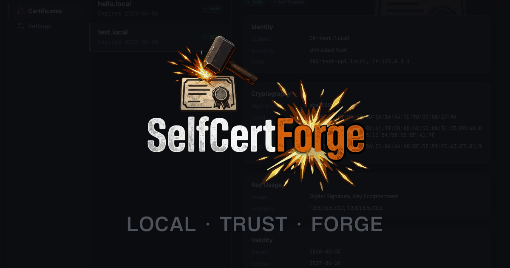
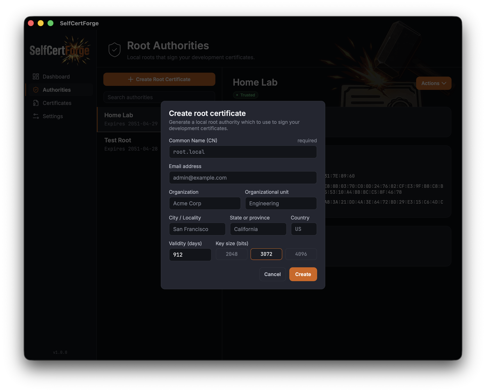
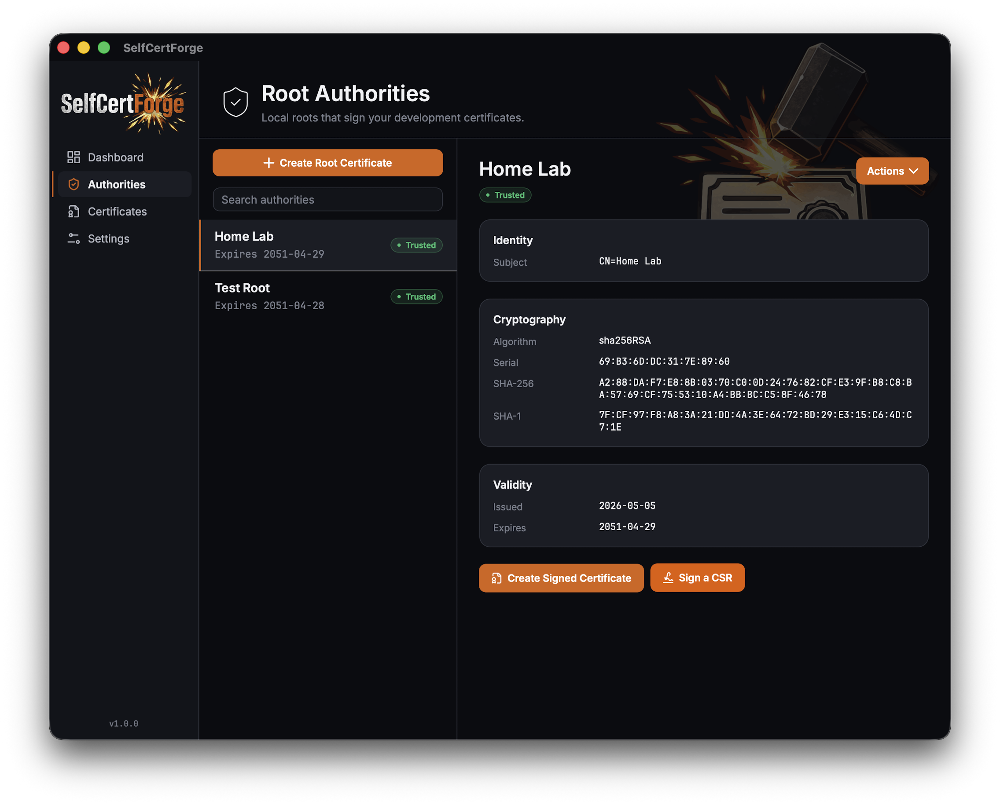
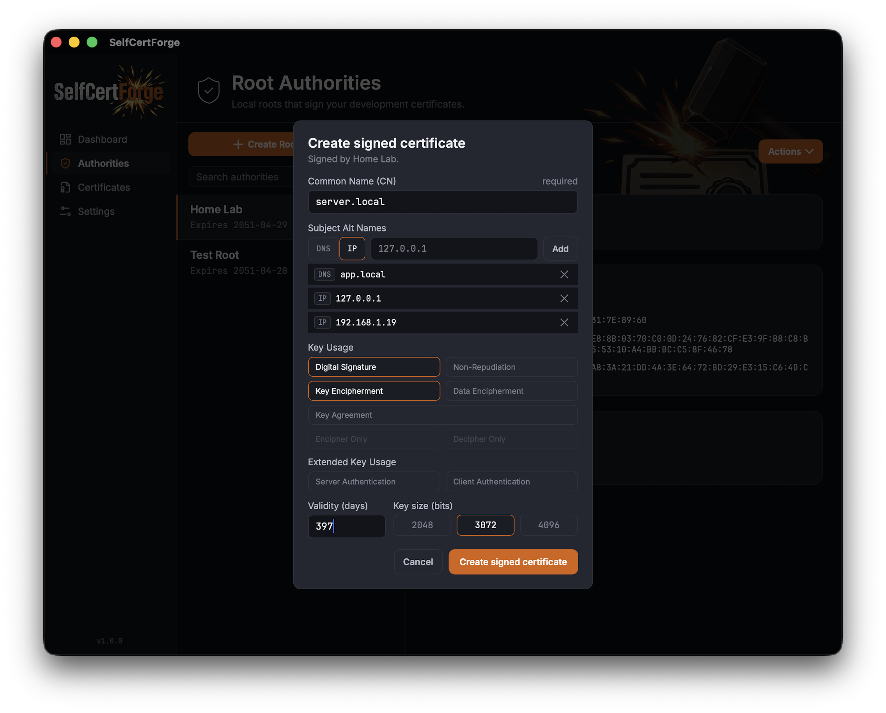
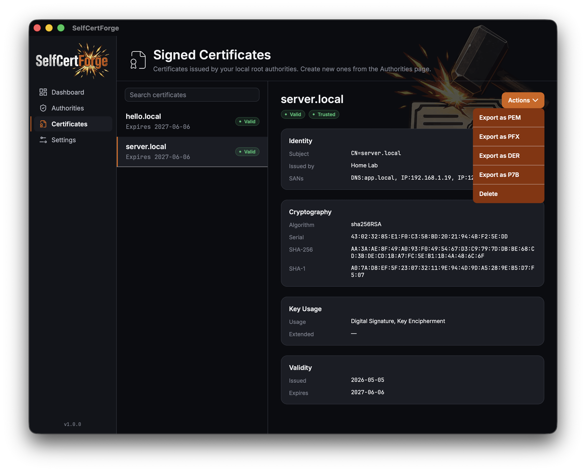

<p align="center">
 	
</p>
<p align="center">
	Generate and manage local certificates on macOS and Windows
</p>
<p align="center">
	<a href="https://github.com/rbonestell/SelfCertForge/releases/latest"></a>
	<a href="https://snyk.io/test/github/rbonestell/SelfCertForge"></a>
	<a href="LICENSE"></a>
</p>

# SelfCertForge

A .NET MAUI desktop app for generating and managing self-signed certificates and root certificate authorities. Use for local development, home labs, and internal tooling.

> [!WARNING]  
> Certificates generated by SelfCertForge are *self-signed* and should **never be used in production or public-facing environments**. Browsers and operating systems will not trust them by default, and they provide no assurance to end users.

Download the appropriate installer for your operating system:

<p align="center">
	<a href="https://github.com/rbonestell/SelfCertForge/releases/latest/download/SelfCertForge-osx-Setup.pkg"></a>
	<a href="https://github.com/rbonestell/SelfCertForge/releases/latest/download/SelfCertForge-win-x64-Setup.exe"></a>
</p>

## Screenshots

<p align="center">
	
	
</p>

<p align="center">
	
	
</p>

## Features

- Create a Root CA (certificate + private key)
- Generate and sign child certificates
- Add generated Root certificates to system trust store
- Export as DER, PEM, PFX, or P7B formats
- Standard X509 field support; Subject, Subject Alternative Names, Key Usage, etc.

## Platforms

- macOS
- Windows

## Development Environment Prerequisites

- .NET 10 SDK with MAUI workload

## Build & Test Commands

```bash
make build    # build the app
make run      # launch the app
make clean    # clean build output
make rebuild  # clean + build
make test     # run tests
```
